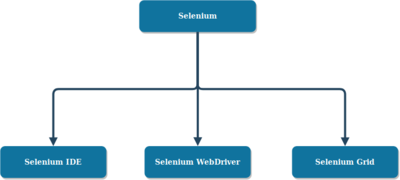

class: inverse, center, middle

# Selenium bemutatása

---

## Selenium

- Böngésző automatizálás, tipikusan webes alkalmazások tesztelésére
- Eszközkészlet, több eszközből áll


---

## Selenium tulajdonságai

- Platformfüggetlen (Windows, Apple OS X, Linux, pl. Ubuntu)
- Képes meghajtani a különböző böngészőket is (Edge, Firefox, Safari, Opera, Chrome)
- [Nyílt forráskódú, ingyenes](https://github.com/SeleniumHQ/selenium)


---

## Felhasználási területek

- Funkcionális tesztelés
- GUI tesztelés
- Regressziós tesztelés
- Böngészőfüggetlenség tesztelése


---

## Selenium helye a tesztpiramisban

- E2E tesztelés
- GUI oldalról
- E2E tesztelés erőforrásigényes teszt készítés és teszt futtatás szempontjából is
  - Rendszer tesztelése a környezetével integrálva
  - Környezet megfelelő állapotban van?
  - Böngészők, virtuális ablakozó rendszer
  - Lassú
- Ne függj törékeny, gyakran változó dolgoktól, mint a GUI
  - Fragile Test Problem - változik a GUI, változtatni kell a teszteseteket

---

## Selenium alkalmazási területei

- Ha kevés teljes folyamaton átívelő, több lépésből álló E2E
  tesztem van, ami a core üzleti funkcionalitást teszteli (happy path), (sanity)
- Megkérdőjelezhetőek a klasszikus alapelvek:
  - Egy teszt egy dolgot tesztel, egy dologra ellenőrzök
    - Több lépés esetén több ellenőrzés
- Ha nem törik el: jön a pénz
- Ha eltörik: nem jön a pénz

---

## Alternatívák

- Robot Framework
- Cypress
- Katalon Studio
- Protractor: Angular környezetben
- [Playwright](https://playwright.dev/)
- Ranorex (kereskedelmi)
- MicroFocus UFT (Unified Functional Test) (kereskedelmi)
- SikuliX
- RAPISE by Inflectra (kereskedelmi)
- SmartBear TestComplete (kereskedelmi)

---

## Eszközök

- Selenium IDE: felvétel és visszajátszás grafikus felületen
- Selenium WebDriver: böngészővezérlés (pl. programozási nyelvekből API-n keresztül)
- Selenium Grid: automatizált tesztelés több gépről, összehangoltan



## Selenium IDE

- Felvétel és visszajátszás (tesztesetek lépésekkel)
- Chrome vagy FireFox Add-On
- Programozási nyelv funkciók: parancskészlet, paraméterezés, változók, vezérlési elemek
- IDE funkciók, pl. projektkezelés, autocomplete, debug
- Parancssori futtatási lehetőség

---

## Környezet felépítése

Docker használatával:

```shell
docker build -t sut-samples .
docker run -d -p 80:80 --name my-sut-samples sut-samples
```

VS Code Live Server Extension használatával

---

## Selenium IDE

- Chrome extension
- Nem letölthető
- 3,4-es értékelés
- Frissítve: 2021. december 8.

---

## Selenium IDE alternatíva: Katalon Recorder

- Record
- Assert: `assertValue`, Selector
- Export Python 2 (WebDriver + unittest)

---

## Selenium WebDriver

- Böngészővezérlés programozottan
- Különböző programozási nyelvekhez illesztés: C#, Groovy, Java, Perl, PHP, Python, Ruby and Scala
- Driver böngészőnként
  - Firefoxhoz [geckodriver](https://github.com/mozilla/geckodriver)
  - Chromehoz [ChromeDriver](https://developer.chrome.com/docs/chromedriver/)
- [WebDriver W3C Recommendation](https://www.w3.org/TR/webdriver1/)

---

## WebDriver


## ChromeDriver

- [ChromeDriver](https://developer.chrome.com/docs/chromedriver/): If you're using Chrome version 115 or newer, consult the Chrome for Testing availability dashboard.
- [Chrome for Testing](https://developer.chrome.com/blog/chrome-for-testing/)
- [Chrome for Testing availability](https://googlechromelabs.github.io/chrome-for-testing/)
- WebDriver képes a lokálisan telepített Chrome-hoz is kapcsolódni
- CI/CD rendszerekben (például GitHub Actions, GitLab CI) ajánlott a CFT használata
- Ha Selenium Manager-t (Selenium 4.6-tól) használsz, az automatikusan letöltheti a CFT megfelelő verzióját a kompatibilitás biztosítása érdekében
- [Security considerations](https://developer.chrome.com/docs/chromedriver/security-considerations)
