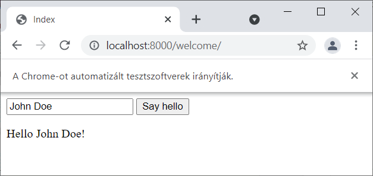

class: inverse, center, middle

# Bevezetés a WebDriver használatába

---

## Selenium WebDriver

- https://github.com/SeleniumHQ/selenium/tree/trunk/py
- https://selenium-python.readthedocs.io/

---

## Új Python projekt

`requirements.txt`

```
selenium
pytest
```

Parancsok:

```shell
python -m venv venv
pip install -r requirements.txt
webdriver-manager
```

---

## Első Python script

```python
from selenium import webdriver
from selenium.webdriver.common.by import By

driver = webdriver.Chrome()

driver.get("http://127.0.0.1:5500/sut-samples/src/welcome")
driver.find_element(By.ID, "name-input").send_keys("John Doe")
driver.find_element(By.ID, "welcome-button").click()
message = driver.find_element(By.ID, "welcome-div").text
print("Message:", message)
```

---

## Ne zárja be hiba esetén a böngészőablakot

```python
from selenium.webdriver.chrome.options import Options

options = Options()
options.add_experimental_option("detach", True)

driver = webdriver.Chrome(options=options)
```

---

## Tesztszoftverek irányítják



```python
options.add_experimental_option("excludeSwitches", ["enable-automation"])
```

---

## Selenium elrejtése

```python
options.add_experimental_option("useAutomationExtension", False)
```

- Egyes weboldalak felismerik az automation extension meglétét, és blokkolhatják vagy másképp kezelhetik a böngészőt
- Kevésbé feltűnő, hogy egy Selenium-vezérelt böngészőről van szó
- Néhány funkció nem működhet

---

## Első pytest teszteset

`python_site_test.py`

```python
from selenium import webdriver
from selenium.webdriver.common.by import By
from selenium.webdriver.chrome.options import Options


def test_welcome():
    options = Options()
    options.add_experimental_option("detach", True)

    driver = webdriver.Chrome(options=options)

    driver.get("http://127.0.0.1:5500/sut-samples/src/welcome")
    driver.find_element(By.ID, "name-input").send_keys("John Doe")
    driver.find_element(By.ID, "welcome-button").click()
    message = driver.find_element(By.ID, "welcome-div").text

    assert message == "Hello John Doe!"
```

Futtatás:

```shell
pytest tests
```

VS Code Python Extension, Testing ablak

A `print()` utasítások kiemenete nem jelenik meg

Megoldás a `-s` kapcsoló, hogy a PyTest ne fogja el a konzolon megjelenő
üzeneteket

```shell
pytest -s tests
```

---

class: inverse, center, middle

# Kódismétlés megszüntetése fixture használatával

---

## Fixture használata

```python
@pytest.fixture
def driver():
    options = Options()
    options.add_experimental_option("detach", True)
    driver = webdriver.Chrome(options=options)
    yield driver
    driver.quit()


def test_welcome(driver):
    driver.get("http://127.0.0.1:5500/sut-samples/src/welcome")
    driver.find_element(By.ID, "name-input").send_keys("John Doe")
    driver.find_element(By.ID, "welcome-button").click()
    message = driver.find_element(By.ID, "welcome-div").text

    assert message == "Hello John Doe!"
```

---

## Automatikus kódkiegészítés

```python
from selenium.webdriver.remote.webdriver import WebDriver

def test_welcome(driver: WebDriver):
    """ ... """
```

---

## Újrafelhasználás több modulban

A `@pytest.fixture` annotációval ellátott függvény kiemelése a `conftest.py`
fájlba

---

class: inverse, center, middle

# Paraméterezhető URL

---

`requirements.txt`

```
python-dotenv
```

```python
@pytest.fixture
def base_url():
    env_file = find_dotenv(".env")
    load_dotenv(env_file)
    return os.getenv("BASE_URL")
```

```conf
BASE_URL=http://127.0.0.1:5500/sut-samples/src/
```

Vigyázat, a végén legyen `/` karakter, mert különben a `join`
hívás lecseréli az utolsó path részletet

## join

```python
from urllib.parse import urljoin

driver.get(urljoin(base_url, "welcome"))
```

---

class: inverse, center, middle

# Komponensek kijelölése (locators)

---

## Egyszerű példa

```java
simple_div = driver.find_element(By.ID, "simple-div");
button = simple_div.find_element(By.NAME, "fullname-input");
```

- `WebDriver` reprezentálja a böngészőt
- `WebElement` reprezentál egy DOM csomópontot
  - `get_attribute()` metódus - visszafele kompatibilitás miatt maradt benne, keveri az attribute és property fogalmát, valamint elég nagy JS megy át a hálózaton
  - `get_dom_attribute()` és `get_dom_property()` megfelelően működik
- `find_element()` mindkettőn meghívható
- `WebElement`-en hívva annak _kontextusában_ keres
- Kontextusban keresés gyorsabb

---

class: inverse, center, middle

# Relatív kijelölés

---

## Relatív kijelölés

https://www.selenium.dev/documentation/webdriver/elements/locators/

- `above()`, `below()`, `toLeftOf()`, `toRightOf()`, `near()` (50px-elen belül)
- (Selenium 4 előtt friendly locators)
- Másik elem, vagy locator is átadható paraméterként
- `getBoundingClientRect()` JavaScript függvényt használja

```java
cell5 = driver.find_element(By.CSS_SELECTOR, "tr:nth-child(2) > td:nth-child(2)")

cell2 = driver.find_element(locate_with(By.TAG_NAME, "td").below(cell5))
assert cell2.text == "2"

cell1 = driver.find_element(locate_with(By.TAG_NAME, "td").to_left_of(cell2))
assert cell1.text == "1"
```

---

class: inverse, center, middle

# Komponensek

---

## Validation methods

```python
element.is_selected()
element.is_enabled()
```

Láthatóság:

```python
element.is_displayed()
```

---

## Listák

```python
list_items = driver.find_elements(By.CSS_SELECTOR, "li")
values = [item.text for item in list_items]
assert values == ["One", "Two", "Three", "Four"]
assert "Two" in values
assert all(elem in values for elem in ["Three", "Two"])
```

---

## Textfield, textarea, password

---

## Checkbox, radiobutton

---

## Select

https://www.selenium.dev/documentation/webdriver/support_features/select_lists/

```python
select = Select(driver.find_element(By.ID, "dropdown"))
select.select_by_value("option2")
assert select.first_selected_option.text == "Option 2"
```

---

## Táblázatok

```python
rows = driver.find_elements(By.CSS_SELECTOR, "tbody > tr")

headers = ["id", "name"]
data = []
for row in rows:
    cells = row.find_elements(By.CSS_SELECTOR, "td")
    values = [cell.text for cell in cells]
    row_dict = dict(zip(headers, values))
    data.append(row_dict)

assert {"id": "2", "name": "Jack Doe"} in data
```

---

class: inverse, center, middle

# Wait

---

## Explicit wait

- https://www.selenium.dev/documentation/webdriver/waits/

```python
wait = WebDriverWait(driver, timeout=2)
```

```python
wait.until(
        lambda _: driver.find_element(By.CLASS_NAME, "alert").text.startswith("Nice")
    )
```

- Poll

```python
wait.until(presence_of_element_located((By.CLASS_NAME, "alert")))
```

---

## Visszatérési értéke az elem

```python
message = wait.until(presence_of_element_located((By.CLASS_NAME, "alert")))

assert message.is_displayed()
assert message.text == "Nice, you triggered this alert message!"
```

---

## expected_conditions modul

https://www.selenium.dev/documentation/webdriver/support_features/expected_conditions/

https://www.selenium.dev/selenium/docs/api/py/webdriver_support/selenium.webdriver.support.expected_conditions.html

---

## Saját condition implementálása

Addig vár, amíg nem `False`-t ad vissza. Azaz ha WebElement-et ad vissza,
akkor az fel is használható.

```python
def has_alert_starts_with(prefix: str):
    def _predicate(driver: WebDriver):
        message = driver.find_element(By.CLASS_NAME, "alert")
        return (
            message
            if message.is_displayed() and message.text.startswith(prefix)
            else False
        )

    return _predicate
```

```
python
message = wait.until(has_alert_starts_with("Nice"))

assert message.text == "Nice, you triggered this alert message!"
```

---

## Implicit wait

```java
driver.implicitly_wait(2)
```

- Nincs hivatalos metódus a lekérdezésére
- Session szinten határozza meg, hogy az elemekre maximum mennyit várjon a WebDriver
- Az explicit és implicit wait nem keverhető!

---

## Wait paraméterek

```python
wait = WebDriverWait(driver, 10, poll_frequency=0.5, ignored_exceptions=[NoSuchElementException])
```

---

class: inverse, center, middle

# Navigáció

---

## Navigáció

```java
driver.get("https://selenium.dev");

driver.current_url;
driver.back();
driver.forward();
```

---

## Refresh

---

## Új tabok és ablakok kezelése

---

## Frame-ek kezelése

---

## Ablak kezelése

---

# Screenshot

```python
driver.save_screenshot("main.png")

button = driver.find_element(By.ID, "message-div")
button.screenshot("div.png")

button.click()
```

- `stale element reference: element is not attached to the page document`

Megoldás: `screenshot()` hívása után újra le kell kérni

```python
button = driver.find_element(By.ID, "message-div")
```

---

# JavaScript futtatás

```python
driver.execute_script("""
        document.querySelector('tr:nth-child(2) > td:nth-child(2)').style.border = 'thin solid #ff0000';
                          """)
```

- Mindig átküldi a hálózaton, ezért lehet _pin_-elni

```python
key = driver.pin_script("""
    document.querySelector('tr:nth-child(2) > td:nth-child(2)').style.border = 'thin solid #ff0000';
    """)
driver.execute_script(key)
```

---

# Nyomtatás

https://www.selenium.dev/documentation/webdriver/interactions/print_page/

- Csak Chromium headless módban: `options.add_argument("--headless")`

```python
print_options = PrintOptions()
pdf = driver.print_page(print_options)
decoded_bytes = b64decode(pdf)
with open("output.pdf", "wb") as f:
    f.write(decoded_bytes)
```

---

# AJAX

monkey-patch `window.fetch`

---

class: inverse, center, middle

# WebDriver BiDi Logging Features

---

```python
options = Options()
options.enable_bidi = True
```

```python
log_entries = []
driver.script.add_console_message_handler(log_entries.append)

button = driver.find_element(By.CSS_SELECTOR, "#log-button")
button.click()

WebDriverWait(driver, 5).until(lambda _: log_entries)
assert log_entries[0].text == "Hello World!"
```

---

class: inverse, center, middle

# Markers

---

# Skip

```python
@pytest.mark.skip(reason="no way of currently testing this")
```

---

# Saját marker

`pytest.ini` fájlban

```ini
markers =
    slow
    issue210
```

```python
@pytest.mark.slow
@pytest.mark.issue210
def test_pep(driver: WebDriver, base_url):
    """ ... """
```

```shell
pytest -m "not slow"
pytest -m "slow and issue210"
```

---

class: inverse, center, middle

# report

---

## pytest-html

- A `requirements.txt` fájlba `pytest-html` függőség, majd `pip install -r requirements.txt`

```shell
pytest --html=report.html --self-contained-html
```

---

## Személyre szabás

```python
from datetime import datetime
from py.xml import html
import pytest


def pytest_html_results_table_header(cells):
    cells.insert(2, html.th("Description"))
    cells.insert(1, html.th("Time", class_="sortable time", col="time"))
    cells.pop()


def pytest_html_results_table_row(report, cells):
    cells.insert(2, html.td(report.description))
    cells.insert(1, html.td(datetime.utcnow(), class_="col-time"))
    cells.pop()


@pytest.hookimpl(hookwrapper=True)
def pytest_runtest_makereport(item, call):
    outcome = yield
    report = outcome.get_result()
    report.description = str(item.function.__doc__)
```

---

## Allure Report

- [Allure Report](https://allurereport.org/)
- Nem natív Python, Java stack kell hozzá

Letölteni és kicsomagolni:

https://github.com/allure-framework/allure2/releases/tag/2.34.0

Python függőség: `allure-pytest`

https://allurereport.org/docs/pytest/

```shell
pytest --alluredir allure-results
```

Teljes elérési úttal, vagy path-ba tenni:

```shell
allure serve allure-results
```

---

## Újrafelhasználás, page object

---

## Adatvezérelt tesztelés

---

## Legjobb gyakorlatok

- Körültekintően nevezzük el a teszteket
- Selectornál támaszkodjunk az `id` értékekre, fejlesztők támogatása szükséges
  - `id` elnevezés legyen konzekvens (elnevezési konvenció)
- Idempotens és izolált
- Tesztesetek legyenek egyszerűek
- DRY - don't repeat yourself
- Használjuk Continuous Integration rendszeren belül

---

## Idempotencia és izoláltság

- Tesztesetek egymásra hatással vannak
  - Állapot: pl. adatbázis
- Ugyanazon tesztkörnyezeten több tesztelő vagy harness dolgozik
- Megoldás:
  - Teszteset "rendet tesz" maga előtt, un. set-up
  - "Rendet tesz" maga után, un. tear down
  - Test fixture
    - Legszélsőségesebb megoldás: adatbázistörlés

---

## Logging Selenium commands

```python
logger = logging.getLogger("selenium")
handler = logging.StreamHandler()
logger.addHandler(handler)
logger.setLevel(logging.DEBUG)
```

```shell
pytest -v -s -p no:logging tests\components_test.py::test_validation_methods
```

- `-s` prevent PyTest from capturing the console
- `-p no:logging` override default PyTest logging settings
